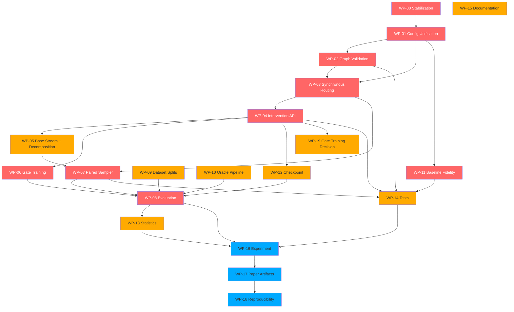

# 10 — Implementation Backlog (v2)

**Total tasks**: 60+, organized into 19 Work Packages.
**Priority**: P0 (must fix before GPU), P1 (before pilot), P2 (before submission).
**Full schema**: Each task below has ID, Priority, WP, Objective, Affected files, Effort.

## WP-00: Repository Stabilization

| ID | Priority | Task | Effort |
|----|----------|------|--------|
| T-00-01 | P0 | Fix README: `cd gauge-sensitive-inverse-generation` → `cd factor-gated-routing` | XS |
| T-00-03 | P0 | Fix .gitignore: remove bare `h5`, `checkpoint*`; add `*.h5`, `checkpoint*/` | XS |
| T-00-04 | P1 | Run `python -m pytest tests/ -v` and verify all tests pass; run `python -c "from src.model import FGRDiT; from src.baselines import *"` import smoke test | M |
| T-00-05 | P1 | Add exact environment lock (pip freeze / conda-lock) | S |

## WP-01: Configuration Unification

| ID | Priority | Task | Effort |
|----|----------|------|--------|
| T-01-01 | P0 | Make train.py read YAML configs instead of hardcoded Python dicts | M |
| T-01-02 | P0 | Make evaluate.py read config from environment or YAML, not hardcoded | M |
| T-01-03 | P0 | Store `model_config` dict in checkpoint | S |
| T-01-04 | P0 | Evaluate reconstructs config from checkpoint, not CLI args | M |
| T-01-05 | P0 | Delete unused `FGRConfig` and `TrainConfig` dataclasses in config.py | XS |
| T-01-06 | P0 | Fix import-time env enforcement: lazy-load DATASET_PATHS in functions, not at module top | XS |

## WP-02: Graph Representation and Validation

| ID | Priority | Task | Effort |
|----|----------|------|--------|
| T-02-01 | P0 | Create `src/graph.py` with DAG validation: cycle check, node range, duplicate edges | M |
| T-02-02 | P0 | Add topological sort to `FGRDiT.forward` — validate edges before forward pass | S |
| T-02-03 | P1 | Enable DENSE_DIRECTED graph mode: all (j,i) for j≠i | S |
| T-02-04 | P1 | Enable node ID permutation consistency — renumbering nodes + permuting params preserves output | M |

## WP-03: Synchronous Layerwise Routing

| ID | Priority | Task | Effort |
|----|----------|------|--------|
| T-03-01 | P0 | Refactor `FGRStream` to expose per-layer forward: `forward_layer(l, x, cond, parent_msgs)` | M |
| T-03-02 | P0 | Implement synchronous routing loop in `FGRDiT.forward`: snapshot all states at layer-(l-1), compute all messages, update all at layer l | M |
| T-03-03 | P0 | Fix `full_ca` mode: must be true all-to-all synchronous attention, not lower-triangular sequential | M |
| T-03-04 | P1 | Add `edge_gates` parameter to per-layer message computation | S |

## WP-04: Intervention API

| ID | Priority | Task | Effort |
|----|----------|------|--------|
| T-04-01 | P0 | Create `src/interventions.py` with `InterventionSpec` dataclass | M |
| T-04-02 | P0 | Implement all 8 modes in `FGRDiT.forward`: observational, factor_edit, condition_mask, direct_output_ablation, factor_source_cut, node_deletion, edge_ablation, neural_graph_surgery | L |
| T-04-03 | P0 | Remove scalar `gates` parameter from public API; replace with `InterventionSpec` | M |
| T-04-04 | P0 | Ensure neural_graph_surgery mode: incoming edges cut, outgoing edges preserved, factor value intervened | M |

## WP-05: Base Stream and Factor Score Decomposition

| ID | Priority | Task | Effort |
|----|----------|------|--------|
| T-05-01 | P1 | Add `BasePredictor` module: lightweight network handling nuisance (x_t, t only) | M |
| T-05-02 | P1 | Replace shared LayerNorm + shared Linear head with per-stream `Norm_i` + `P_i` | M |
| T-05-03 | P1 | Implement additive output: `ε = ε_base + Σ o_i · P_i · Norm_i(h_i)` | S |
| T-05-04 | P2 | Add centering regularization: encourage E_{F_i}[ε_i] ≈ 0 | L |

## WP-06: Gate Exposure Training

| ID | Priority | Task | Effort |
|----|----------|------|--------|
| T-06-01 | P0 | Implement training-time gate dropout: g_i ~ Bernoulli(1-p) or Beta(α,β) | S |
| T-06-02 | P1 | Implement path-invariance loss: ||ε(f_i; o_i=0) - ε(f_i'; o_i=0)||² | M |
| T-06-03 | P2 | Implement leakage penalty: cross-Jacobian norm for forbidden edges | L |

## WP-07: Paired Sampler and NoiseTrace

| ID | Priority | Task | Effort |
|----|----------|------|--------|
| T-07-01 | P0 | Create `src/sampling.py` with `NoiseTrace` dataclass (x_T, per_step_noise, schedule) | M |
| T-07-02 | P0 | Modify `sample_images` to accept pre-generated NoiseTrace instead of generating internally | M |
| T-07-03 | P0 | Implement deterministic DDIM (η=0) sampler option | S |
| T-07-04 | P0 | Verify identity property: same model + condition + NoiseTrace → exact same output | S |

## WP-08: Evaluation and Metrics

| ID | Priority | Task | Effort |
|----|----------|------|--------|
| T-08-01 | P0 | Rewrite evaluate.py: use shared NoiseTrace for normal→intervention comparison | L |
| T-08-02 | P0 | Implement `LeakageMatrix`: K×K matrix L_ij = P[Oracle_j(x_edit_i) ≠ Oracle_j(x_original)] | M |
| T-08-03 | P0 | Ensure new_factor ≠ old_factor (offset sampling, not independent randint) | XS |
| T-08-04 | P0 | Separate evaluation into 3 protocols: factor_edit, factor_source_cut, neural_graph_surgery | M |
| T-08-05 | P1 | Add non-target preservation per-factor metric S_i | S |
| T-08-06 | P1 | Fix conditional accuracy overwrite bug (measure once, not per-loop) | XS |
| T-08-07 | P2 | Implement gate response AUC, monotonicity violation count, local sensitivity | M |

## WP-09: Dataset Splits and Lazy Loading

| ID | Priority | Task | Effort |
|----|----------|------|--------|
| T-09-01 | P1 | Create `src/splits.py` with held-out combination splits | M |
| T-09-02 | P1 | Implement `HeldOutPairSplit`, `SystematicCompositionalSplit` | L |
| T-09-03 | P1 | Fix 3DShapes loader: lazy HDF5 access, per-worker file handle | M |
| T-09-04 | P1 | Fix dSprites loader: add position x/y as nuisance (not conditioned) or as factor streams | M |
| T-09-05 | P2 | Add data preprocessing hash and manifest for reproducibility | S |

## WP-10: Oracle Pipeline

| ID | Priority | Task | Effort |
|----|----------|------|--------|
| T-10-01 | P1 | Create `src/oracle_train.py`: proper training script with validation | M |
| T-10-02 | P1 | Add factor-level confusion matrix and calibration reporting | M |
| T-10-03 | P2 | Test oracle on generated images vs ground-truth to quantify domain shift | M |
| T-10-04 | P2 | Add oracle ensemble or multiple-architecture agreement check | L |

## WP-11: Baseline Fidelity

| ID | Priority | Task | Effort |
|----|----------|------|--------|
| T-11-01 | P0 | Rename `CoInDDiT` → `IndependentStreamDiT` | XS |
| T-11-02 | P0 | Rename `EncDiffDiT` → `CrossAttnDiT` or implement actual concept tokens | M |
| T-11-03 | P0 | Fix CF-DiT: add dedicated null index (factor_size + 1) per factor embedding | M |
| T-11-04 | P0 | Fix DiTBlock: add residual gating α and zero-initialization (adalN-Zero) | M |
| T-11-05 | P1 | Consider implementing actual CoInD Fisher divergence loss or drop baseline | L |
| T-11-06 | P2 | Report FLOPs, sequential depth, latency alongside parameter count | M |

## WP-12: Checkpoint and Resume

| ID | Priority | Task | Effort |
|----|----------|------|--------|
| T-12-01 | P0 | Save full training state in checkpoint: model, optimizer, scheduler, scaler, RNG, config, graph, step | M |
| T-12-02 | P1 | Implement `--resume` flag for training continuation | M |
| T-12-03 | P1 | Fix checkpoint save condition: decouple from log_every (use independent check) | XS |

## WP-13: Statistics

| ID | Priority | Task | Effort |
|----|----------|------|--------|
| T-13-01 | P1 | Implement paired bootstrap confidence intervals | M |
| T-13-02 | P1 | Multi-seed training (≥5 seeds for confirmatory experiments) | L |
| T-13-03 | P2 | Binomial CI for accuracy metrics, effect size reporting | M |

## WP-14: Tests

| ID | Priority | Task | Effort |
|----|----------|------|--------|
| T-14-01 | P0 | Graph validation tests (cycle detection, node range, duplicate edges, topological sort) | M |
| T-14-02 | P0 | Path invariance test: same NoiseTrace + f_i changed + g_i=0 → identical output | M |
| T-14-03 | P0 | Identity test: same model + condition + NoiseTrace → exact match | S |
| T-14-04 | P0 | InterventionSpec validation tests (invalid modes, inconsistent specs) | M |
| T-14-05 | P1 | Graph surgical test: incoming cut + outgoing preserve verified | M |
| T-14-06 | P1 | Checkpoint roundtrip test: save → load → output matches | M |
| T-14-07 | P1 | CF-DiT null token ≠ class 0 test | S |
| T-14-08 | P1 | Dataset split disjointness and held-out combination test | M |
| T-14-09 | P2 | Metric identity test: no-op intervention gives zero edit rate | S |
| T-14-10 | P2 | Baseline parameter/FLOP correctness audit | M |

## WP-15: Documentation

| ID | Priority | Task | Effort |
|----|----------|------|--------|
| T-15-01 | P0 | Rewrite MATH_NOTES: remove Prop 4, downgrade Prop 2, correct Prop 1, add Path Non-Interference Theorem | M |
| T-15-02 | P0 | Remove all do-operator language from README and MATH_NOTES | S |
| T-15-03 | P1 | Update README architecture diagram and baseline table | M |
| T-15-04 | P1 | Add INTERVENTION.md describing the 8 intervention modes | M |

## WP-16: Experiment Orchestration

| ID | Priority | Task | Effort |
|----|----------|------|--------|
| T-16-01 | P1 | Create `src/experiment.py`: single entry point for full experiment pipeline | L |
| T-16-02 | P1 | Support experiment manifest (YAML) specifying model × dataset × seed × split grid | M |

## WP-17: Paper Artifact Generation

| ID | Priority | Task | Effort |
|----|----------|------|--------|
| T-17-01 | P2 | Auto-generate LaTeX tables from eval JSON output | M |
| T-17-02 | P2 | Auto-generate figure scripts for leakage matrix heatmaps, gate curves | M |

## WP-18: Reproducibility Release

| ID | Priority | Task | Effort |
|----|----------|------|--------|
| T-18-01 | P2 | Create Docker/singularity environment | L |
| T-18-02 | P2 | Release oracle checkpoint, experiment manifest, exact commit hash in paper | S |

---

## Dependency DAG (Mermaid — corrected)

